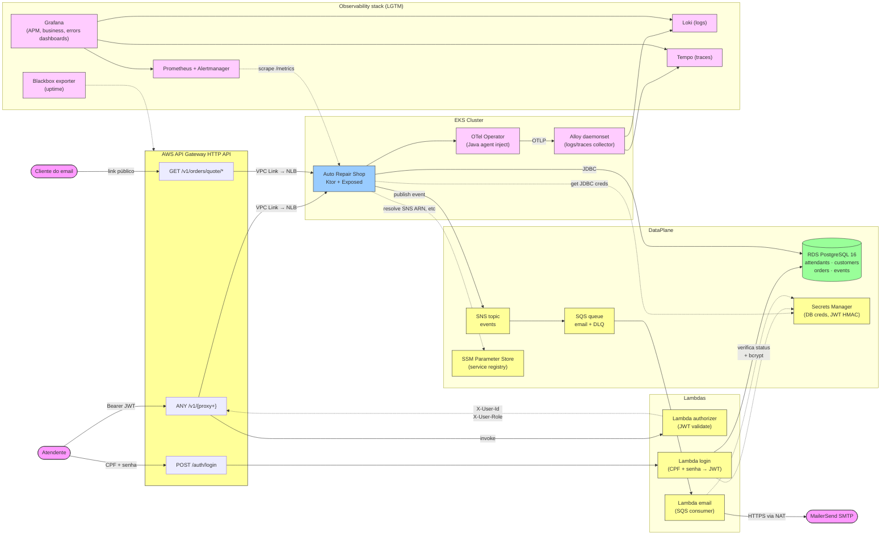

# 01. Component Overview

Visão de alto nível dos componentes do Auto Repair Shop na AWS.

## Componentes principais

| Componente | Responsabilidade |
|---|---|
| **API Gateway HTTP API** | Entrada única. Roteia para Lambdas (auth) e VPC Link → NLB → app |
| **Lambda authorizer** | Valida JWT a cada request `/v1/*` protegido, injeta headers `X-User-Id` e `X-User-Role` |
| **Lambda login** | Recebe `POST /auth/login`, valida CPF + bcrypt, consulta `users.status='ACTIVE'`, emite JWT |
| **Lambda email** | Consumidor SQS; renderiza template e envia via MailerSend |
| **App (EKS)** | Domínio: ordens de serviço, clientes, veículos, atendentes, serviços, suprimentos |
| **RDS PostgreSQL 16** | Único banco; databases lógicos por env; user `app_*` + user `grafana_*` |
| **SNS → SQS** | Outbox pattern: app publica `external=true` events, SQS distribui pra Lambda email |
| **LGTM stack** | Prometheus (metrics), Loki (logs), Tempo (traces), Grafana (UI), Alertmanager (alertas) |

## Fluxos atravessando a borda

1. **Atendente autentica** → `POST /auth/login` → JWT
2. **Atendente acessa rota protegida** → `Authorization: Bearer <jwt>` → authorizer valida → app processa
3. **Cliente aprova orçamento** → link do email → `GET /v1/orders/quote/approve?token=...` (público, sem authorizer)
4. **App emite email** → grava em `events` (outbox) → scheduler publica em SNS → SQS → Lambda email → MailerSend
