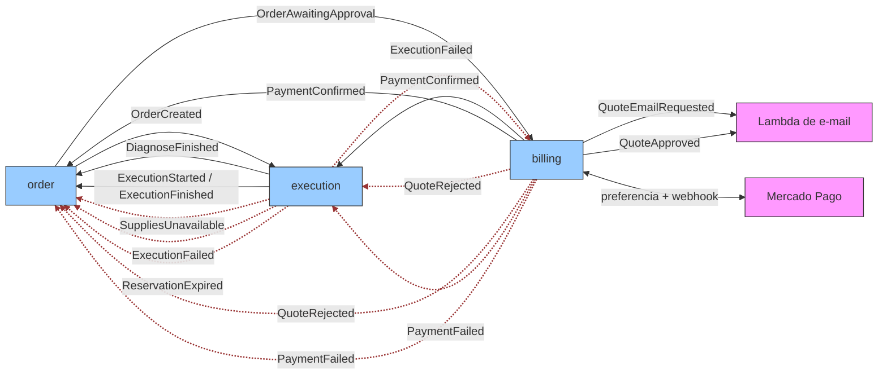
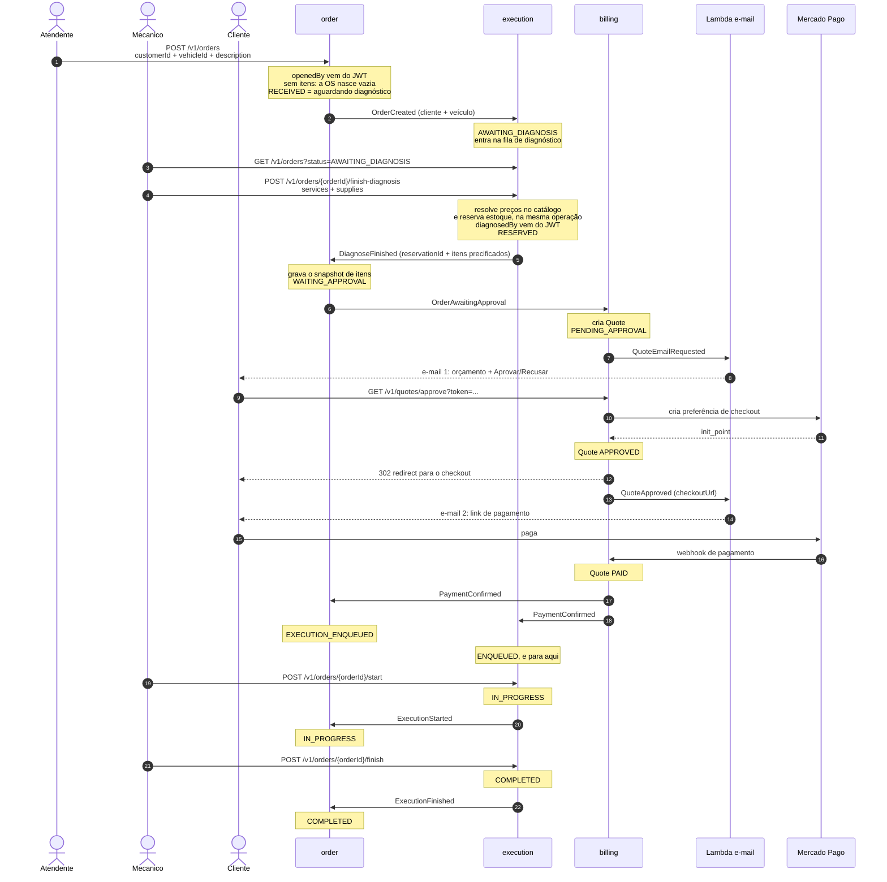
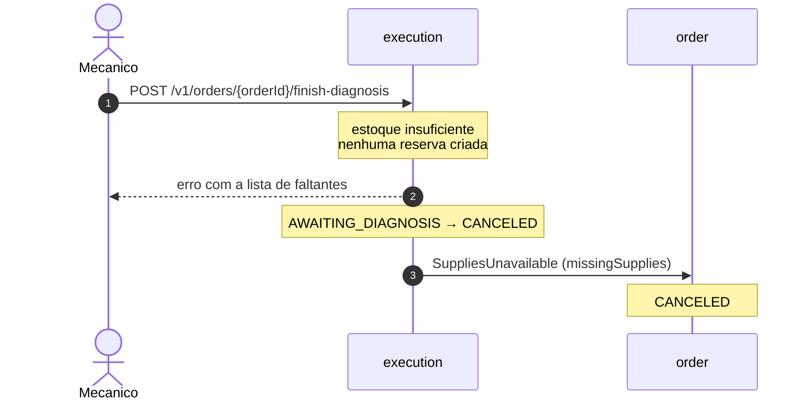
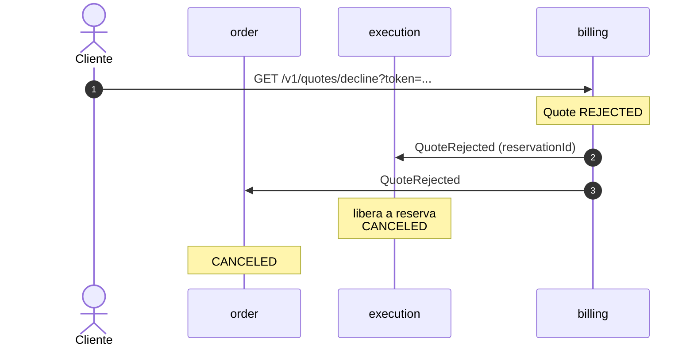
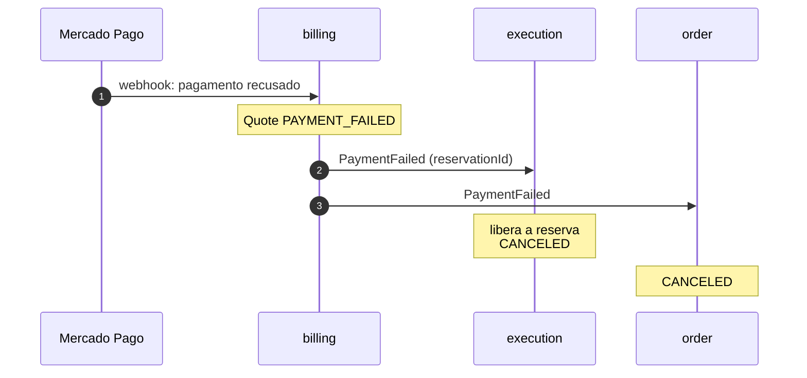
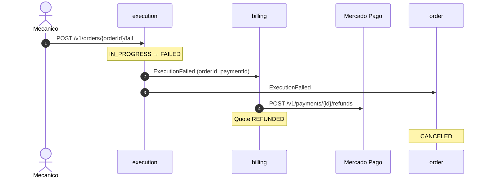
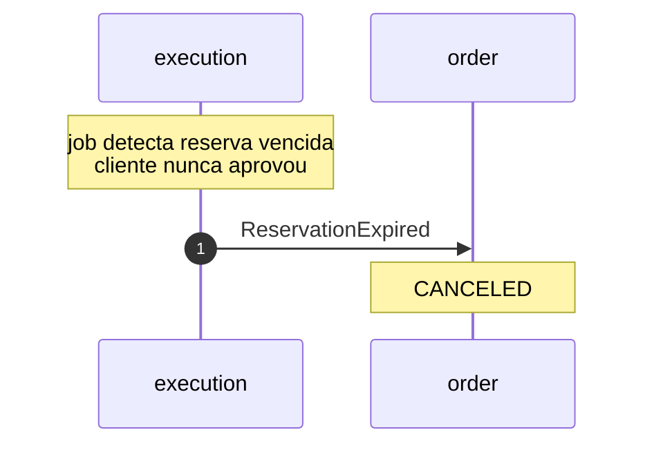

# 02. Saga Coreografada

Como a saga do Auto Repair Shop se comporta: quem publica cada evento, quem reage,
e o que acontece em cada caminho de rollback.

> Este documento é a vista visual da saga. A norma (envelope, topologia, payloads,
> convenções e máquinas de estado) vive em [`saga-event-contract.md`](../saga-event-contract.md).
> Mudança de evento começa lá.

## Sobre a notação

Não existe padrão formal para saga **coreografada**. O BPMN 2.0 define *Choreography
Diagrams*, que seriam a resposta canônica, mas o ferramental é escasso e o mermaid não
suporta. A convenção prática é combinar três vistas, e é o que este documento faz:

| Vista | Responde | Notação |
|---|---|---|
| Matriz publica/escuta | quem produz, quem reage | tabela + flowchart |
| Diagrama de sequência | em que ordem, e o que compensa o quê | `sequenceDiagram` |
| Máquina de estados | o estado derivado de cada serviço | `stateDiagram-v2` |

A terceira vista é a que importa mais aqui: **em coreografia não há estado central da
saga**. Cada serviço deriva o próprio estado dos eventos que recebe, e o "estado da saga"
só existe como a composição dos três.

> **Atenção ao ler os diagramas:** as setas indicam quem **reage** a cada evento, não a
> topologia de assinatura. Fisicamente a malha é completa: a fila de cada serviço assina
> os tópicos dos outros dois por inteiro, recebe um superset e **descarta por `eventType`
> o que não trata**. A única assinatura filtrada é a da Lambda de e-mail.

## Divisão de responsabilidades

O diagnóstico mora no execution, e o order é o read model da saga:

| Serviço | Responsabilidade |
|---|---|
| **order** | ciclo de vida da OS: abertura, status, histórico |
| **execution** | catálogo de serviços, estoque de insumos, reservas, diagnóstico, fila de execução |
| **billing** | orçamento e pagamento |

O order não conhece catálogo nem preço. Recebe os itens já precificados pelo
`DiagnoseFinished` e os grava como snapshot.

Duas ações do mecânico movem a saga e não são eventos: `finish-diagnosis`, que resolve
preços e reserva estoque, e `start`, que tira a OS da fila. Coreografia não quer dizer que
tudo seja assíncrono, e sim que ninguém orquestra.

## Matriz de publicação e escuta

Linha cheia é caminho de avanço; tracejada em vermelho é compensação. São 17 setas: os
índices 0–8 são o avanço e 9–16 as compensações. O `linkStyle` conta a partir de 0, na
ordem em que as setas aparecem no código, e recontar é obrigatório sempre que uma seta
entra ou sai.

O ciclo `order → execution → order → billing` é o coração do desenho: o execution devolve
ao order o resultado do diagnóstico, e é o order, dono da OS, que anuncia ao billing que
há orçamento a montar. O billing nunca escuta o execution no caminho feliz.

## Fluxo feliz

O `PaymentConfirmed` **para** em `ENQUEUED`: quem avança para `IN_PROGRESS` é o `/start`,
chamado pelo mecânico. Sem essa separação a fila não existiria: o estado enfileirado nunca
seria persistido e a consulta por status voltaria vazia.

O redirect 302 e o e-mail 2 levam **a mesma URL**. O e-mail existe para quem fecha a aba
do checkout antes de pagar.

`DELIVERED` não aparece aqui: é transição local do order na retirada do veículo, sem evento.

## Cenários de rollback

A saga não tem transação distribuída: cada compensação é um evento novo que desfaz um
efeito já aplicado. São cinco caminhos.

### 1. Insumo indisponível

Falha no fechamento do diagnóstico, antes de existir orçamento. Nada a compensar além da
própria OS, porque nenhuma reserva chegou a ser criada.

**Decisão registrada:** com o diagnóstico síncrono, o mecânico está na frente do computador
e responder só um erro, mantendo a OS aberta para nova tentativa, seria mais proporcional
do que cancelar o atendimento inteiro porque faltou um filtro. Foi avaliado e recusado: o
comportamento de cancelar permanece. O `finish-diagnosis` faz as duas coisas: informa o
mecânico, com nome e quantidades do que faltou, **e** publica o evento de cancelamento.

### 2. Cliente recusa o orçamento

O `reservationId` viaja no evento justamente para isto: o execution devolve o estoque sem
precisar consultar ninguém. Ele nasce no `DiagnoseFinished`, chega ao billing repassado
pelo order dentro do `OrderAwaitingApproval`, e volta nas compensações.

### 3. Pagamento recusado

Idêntico ao anterior do ponto de vista do execution: mesma compensação, gatilho diferente.
Vale para a reserva tanto em `RESERVED` quanto em `ENQUEUED`.

### 4. Falha durante a execução (com pagamento já feito)

O único caminho que envolve devolver dinheiro.

O `paymentId` só existe porque o execution o guardou ao processar o `PaymentConfirmed`.
Com a remoção do estado `DIAGNOSED`, a falha transiciona apenas a partir de `IN_PROGRESS`,
estado só alcançável depois da confirmação do pagamento, então o campo está sempre
presente aqui, e o estorno nunca fica sem destino.

### 5. Reserva expirada

Job interno do execution, sem gatilho externo.

## Lacunas conhecidas

**A recusa do orçamento não tem prazo próprio.** Se o cliente simplesmente ignora o
e-mail, quem encerra a saga é o `ReservationExpired`, pelo TTL da reserva, não pelo TTL do
token de aprovação.

**O diagnóstico não tem prazo.** Uma OS que fica em `RECEIVED` porque ninguém rodou o
`finish-diagnosis` não é cancelada por nada: não há reserva ainda, logo não há
`ReservationExpired` para expirar.

**A fila de execução também não tem prazo.** Uma OS paga que fica em `ENQUEUED` porque
ninguém chamou o `/start` permanece lá indefinidamente, já com o dinheiro do cliente.

**Não há reabertura de diagnóstico.** Depois do `DiagnoseFinished`, os itens da OS são
imutáveis. Corrigir um diagnóstico errado exige cancelar e abrir outra OS.

**`DELIVERED` não vem de evento.** É transição local do order, disparada pela retirada do
veículo. Não participa da coreografia.

**A verificação de assinatura do webhook do Mercado Pago está desativada.** O
`MercadoPagoSignatureValidator` retorna `true` sem validar HMAC. Qualquer POST no endpoint
do webhook consegue mover uma quote de `APPROVED` para `PAID`.
